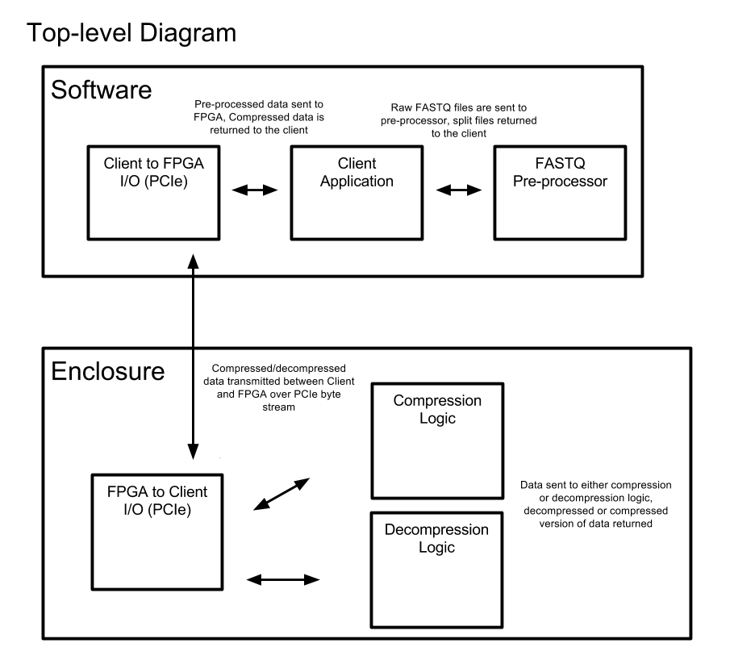
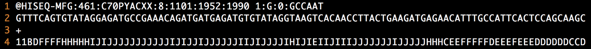
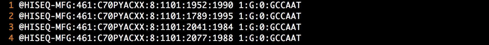
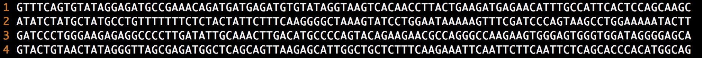
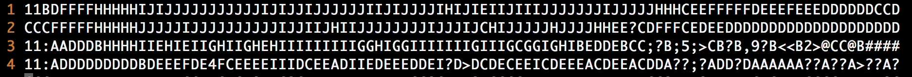
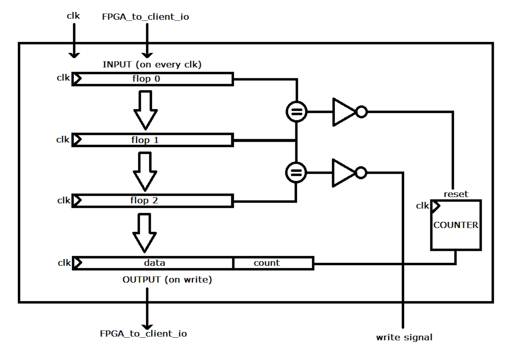
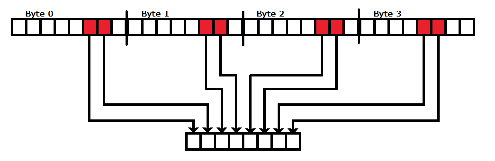
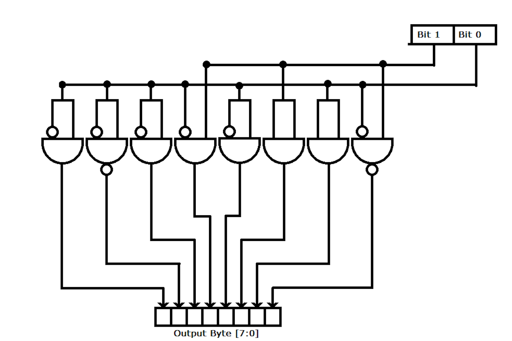

# Hardware Compression Acceleration of FASTQ Gene Sequence Files

As we enter the age of low cost, high accuracy next generation gene 
sequencing machines and computational biology, there will be an explosion 
of genitic data. This project seeks to implement a cost effective lossless
 compression / decompression scheme to operate on Illumina FASTQ files and be 
implemented on an FPGA for highly parallel operation.

<br />

In this repository there are two parts. The first part is the C Prototype 
of the project that can be run on any host machine. This allows for the 
development and testing of the design of the compression algorithm for its 
compression ratio and genearl functionality.

<br /> 

The second portion of this repository consists of the Verilog files that 
implement the prototype in HDL. This project was written for use with a
Xilinx development board but the files in this repository are basic verilog
that can be moved elsewhere. 

## System Overview



## C Prototype

The C prototype version can be used to see the functionality and compression ratio 
performance of the compression scheme. The goal of this project was to build a 
highly parallel system by utilzing an FPGA. This will obviously not be possible to 
do on a standard cpu. Therefore, while we can still examin the improvement in 
compression ratio, we will not see the speed improvement we would experience by 
implementing the scheme in hardware.

### Usage

To get access to the C prototype, move from the main repository directory into the 
C-Prototype directory. Either move your own fastq file or use the small profided one 
`test.fastq`.

Compression:
```
./FastqUC -c <input file name> <output file name>
```

Decompression:
```
./FastqUC -d  <input file name> <output file name>

```

## Design

### FASTQ File Input

To understand the compression operations it is important to understand the format 
of the fastq files. In a fastq file there are four line sets that continue to repeat
until the end of the read. These lines are as follows.

1. The name of the specific read.
2. The gene sequence itself.
3. a blank line that can be replaced with another copy of the name.
4. The quality scores which represent the quality of the read.

An example of a fastq file can be seen below:

 

## Compression

### Preprocessing

Two important things to notice when you are looking at a fastq file is that the data in 
each of the four repeated lines is very different than the data in the other three and 
that, for the most part, the data in like lines (every fourth line) are very similar to 
one and other. Therefore, we can immediately and drastically reduse the entropy of the 
file by seperating it into three files that consist of only like lines. So we go from 
our original fastq file to three seperate files.

<br />

The name file:


The gene file:


The read quality file:


These three files can then be fed to hardware compression blocks for seperate and parallel 
compression. There are only three files instead of four because we do not need to compress 
the blank / second name line.

### Sequence Name Compression

When looking at the sequence identifier (name) file we can see that almost all of the information 
from line to line is the same. There are a few numbers that change, but for the most part 
all the information is repeated line after line. If you look at a large enough fastq file 
you will notice that some of the numbers that appear to be static actually do change after a
megabyte of file. Other sections, like the ID of the sequencer used (first section) never change. 
There for the strategy that was developed to compress this ID file is to split the colon seperated 
segments of the ID into individual streams and apply a form of run length encoding to them. 

<br />

In hardware the run length encoder will look like this:



As data is fed into the block it enters a four stage pipeline. While the data repeated the block 
will not write any data to the output and a counter will increment. When a change in the pipeline 
is detected, it enters into first stage where it triggers a reset to the counter. On the next stage 
the write signal is set and the value of the previous data and the counter before the reset is 
written to file.

<br /> 

While this method may not appear to be highly parallel due to its dependency on preivous data, this 
process can be taken up at any line in the file without knowledge of previous run lengths. Therefore, 
in hardware you can implement multiple blocks and multiple streams at seperate locations in the file 
to achieve highly parallel processing.

### Gene Sequence Compression

For the gene sequence itself we have elected to implement a very simple fixed length encoding scheme. 
This choice was selected for both its highly parallelizable nature and for the fact that by taking 
advantage of a coincidence if ASCII, it is a fairly elegant solution.

<br />

The ASCII values for gene letters are as follows:

```
A: 01000001
C: 01000011
G: 01000111
T: 01010100
```

Now lets look at only the second and first bits:

```
A[2:1]: 00
C[2:1]: 01
G[2:1]: 11
T[2:1]: 10
```
As we can see, we have a different encoding for each of the letters just by pulling the second and 
first bits. This makes hardware implementation very simple:



As long as the number of sequence reads is divisible by four (which Illumina sequences are) then 
you can string these blocks one after another until an entire line is compressed in a single clk. 
from there you can add those blocks for different file streams the same way as was designed for in 
the sequence name compression section.

### Read Quality Score Compression

For the moment read quality scores are being gziped on the client. We hope to design a more effective
way to compress this data soon.


## Decompression

### Sequence Name Decompression

The sequence name decompressor takes the compressed file fields with the counters attached and outputs 
the data until the counter runs to zero. The write bit is always set. when the counter runs to zero then 
a flop takes place and allows the next entry from memory to enter the write output register.

### Gene Sequence Decompression

The two bit encodings are fed into a block that builds the byte. The logic of this block is as follows:



There is a write back to file after each clock cycle.

### Postprocessing

Once the files have been decompressed back into there seperated three data types, a bash script is run 
to reshuffle them into the proper fastq format. 


